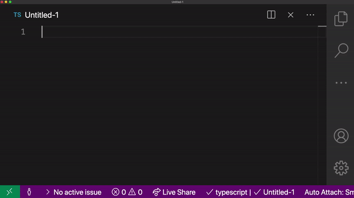
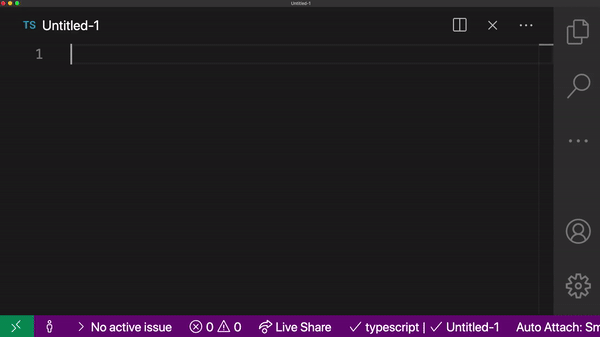
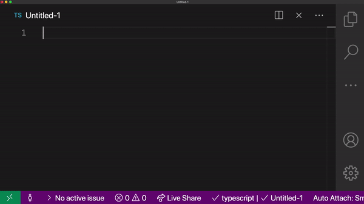

# InstantCode

This VSCode extension allows JavaScript and TypeScript developers to get instant feedback on their code as they type it! 💨

Forget about code playgrounds and REPLs. Say goodbye to waiting for your entire project to compile before you can see your logged values or debugger to run. If you want to see the result of a code block just wrap it in a function and watch your code getting instantly evaluated as you type inside your editor! ⚡️

## Features

🔥 Runs your functions as you type them

🔥 Generates random test data on the fly

🔥 Works with discriminated unions

🔥 Works with more complex types

## Caveats

This extension is currently at an experimental stage. It does not yet support external file imports. All types and functions referenced must be declared within the same file for the extension to work correctly.

Issues and Pull Requests are more than welcome 🤗
